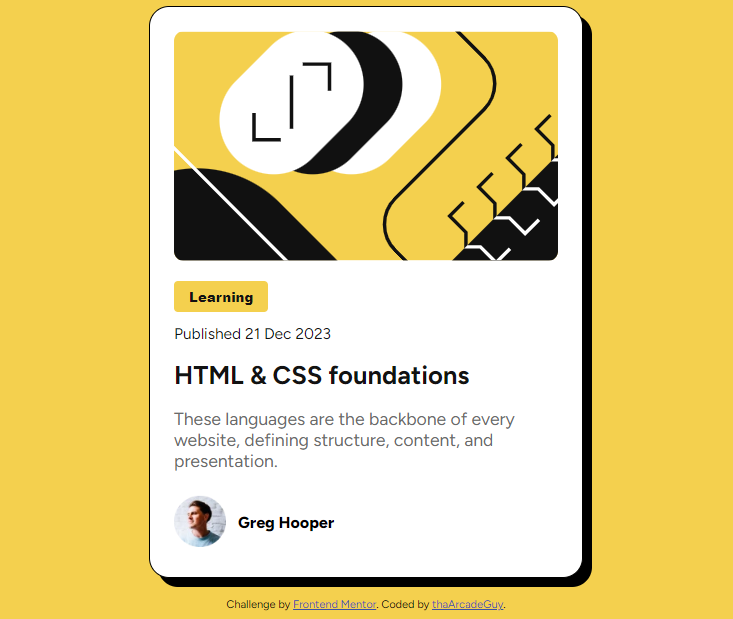

# Frontend Mentor - Blog preview card solution

This is a solution to the [Blog preview card challenge on Frontend Mentor](https://www.frontendmentor.io/challenges/blog-preview-card-ckPaj01IcS). Frontend Mentor challenges help you improve your coding skills by building realistic projects. 

## Table of contents

- [Overview](#overview)
  - [The challenge](#the-challenge)
  - [Screenshot](#screenshot)
  - [Links](#links)
- [My process](#my-process)
  - [Built with](#built-with)
  - [What I learned](#what-i-learned)
  - [Continued development](#continued-development)
  - [Useful resources](#useful-resources)
- [Author](#author)

## Overview

### The challenge

Users should be able to:

- See hover and focus states for all interactive elements on the page

### Screenshot

### Links

- Solution URL: (https://github.com/thaArcadeGuy/blog-preview-card)
- Live Site URL: (https://thaarcadeguy.github.io/blog-preview-card/)

## My process

### Built with

- HTML5 markup
- CSS 
- Flexbox

### What I learned

Before I take on  any challenge I am a little itimidated but now as I a take on more challenges I am getting more confident. I should say my confidence in CSS is increasing.

### Continued development

I want to focuse more on responsive web desigining.

### Useful resources

- [Resource 1](https://www.w3schools.com/html/html_responsive.asp) 
- [Resource 2](https://www.w3schools.com/css/css_rwd_intro.asp) - These two helped with the basics of Responsive Web Design and  I am looking forward to learn more.

## Author

- LinkedIn - [Kambere Gilbert Silver](https://www.linkedin.com/in/kambere-gilbert-silver/)
- Frontend Mentor - [@thaArcadeGuy](https://www.frontendmentor.io/profile/thaArcadeGuy)
- Twitter - [@thaArcadeGuy](https://www.x.com/thaArcadeGuy)
